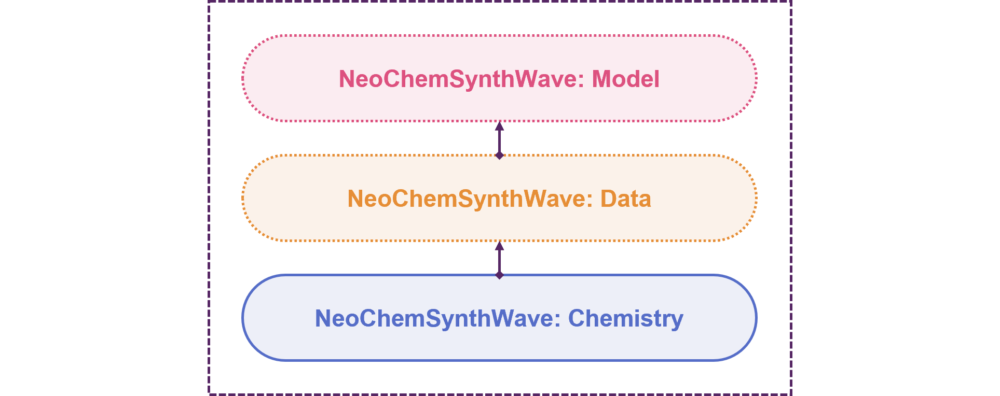

# NeoChemSynthWave: Chemistry
[](https://github.com/neo-chem-synth-wave/ncsw-data/releases/tag/2025.4.1)
[](https://www.isct.ac.jp)
[](https://www.elix-inc.com)

Welcome to the **NeoChemSynthWave: Chemistry** project !!!



Over the past decade, computer-assisted chemical synthesis has re-emerged as a research subject of significant
importance within Chem(o)informatics. Even though the idea of using computers to assist chemical synthesis has existed
for nearly as long as computers themselves, achieving the expected blend of reliability and innovation has remained a
challenge. Nevertheless, recent machine learning approaches exhibit the potential to address these shortcomings.
Considering the interdisciplinary nature of such approaches, collaboration among researchers from various backgrounds is
paramount to maximizing success. Consequently, the main objective of the **NeoChemSynthWave: Chemistry** project is to
provide essential programming utilities that are easy to use regardless of background and skill level.


## Installation
A standalone environment can be created using the [git](https://git-scm.com) and [conda](https://conda.io) commands as
follows:

```shell
git clone https://github.com/neo-chem-synth-wave/ncsw-chemistry.git

cd ncsw-chemistry

conda env create -f environment.yaml

conda activate ncsw-chemistry-env
```

The [ncsw_chemistry](/ncsw_chemistry) package can be installed using the [pip](https://pip.pypa.io) command as follows:

```shell
pip install --no-build-isolation -e .
```


## License Information
The contents of this repository are published under the [MIT](/LICENSE) license. Please refer to individual references
for more details regarding the license information of external resources utilized within this repository.


## Contact
If you are interested in contributing to this repository by reporting bugs, suggesting improvements, or submitting
feedback, feel free to do so using [GitHub Issues](https://github.com/neo-chem-synth-wave/ncsw-chemistry/issues).
